<div align="center">

# 🐾 Clicker Simulator

**Um clicker idle completo com 180+ pets, 5 mundos, prestígio duplo, mercado entre jogadores e muito mais!**

[](https://github.com/BielzinYT/clicker-simulator/releases)
[](https://github.com/BielzinYT/clicker-simulator/releases)
[](LICENSE)
[](https://github.com/BielzinYT/clicker-simulator/releases)

[📥 Descarregar](https://github.com/BielzinYT/clicker-simulator/releases/latest) · [🐛 Reportar Bug](https://github.com/BielzinYT/clicker-simulator/issues) · [💡 Sugerir Feature](https://github.com/BielzinYT/clicker-simulator/issues)

</div>

---

## 📸 Screenshots

### 🗺️ Os 5 Mundos

| 🌱 Mundo Iniciante | 🌴 Mundo Selva |
|:---:|:---:|
| 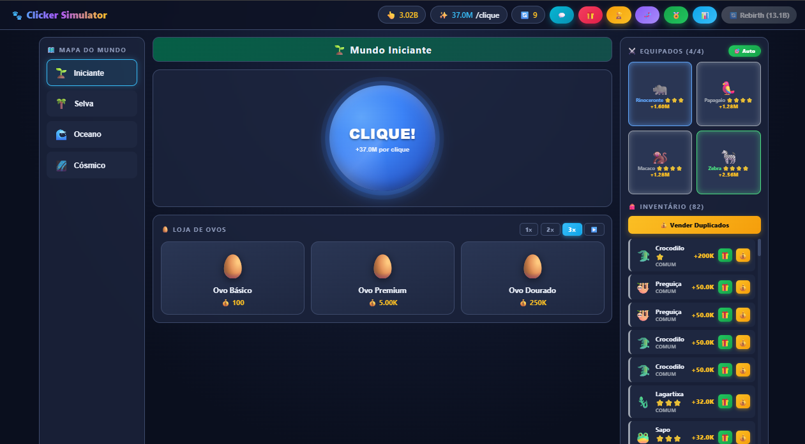 | 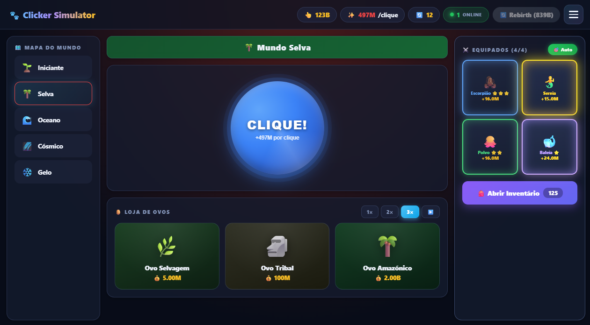 |
| O ponto de partida. Ovos baratos para começar. | Desbloqueado com **1 rebirth**. Pets selvagens! |

| 🌊 Mundo Oceano | 🌌 Mundo Cósmico |
|:---:|:---:|
| 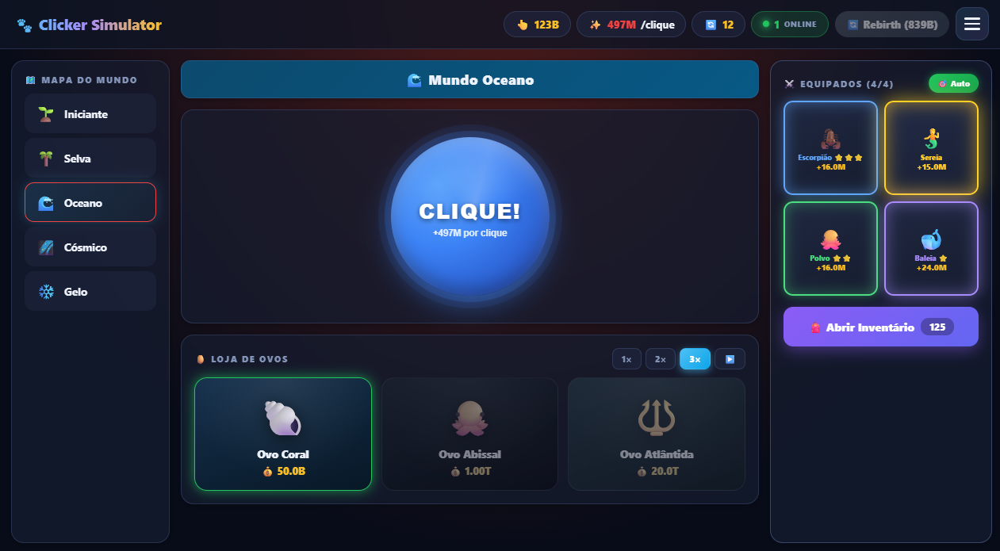 | 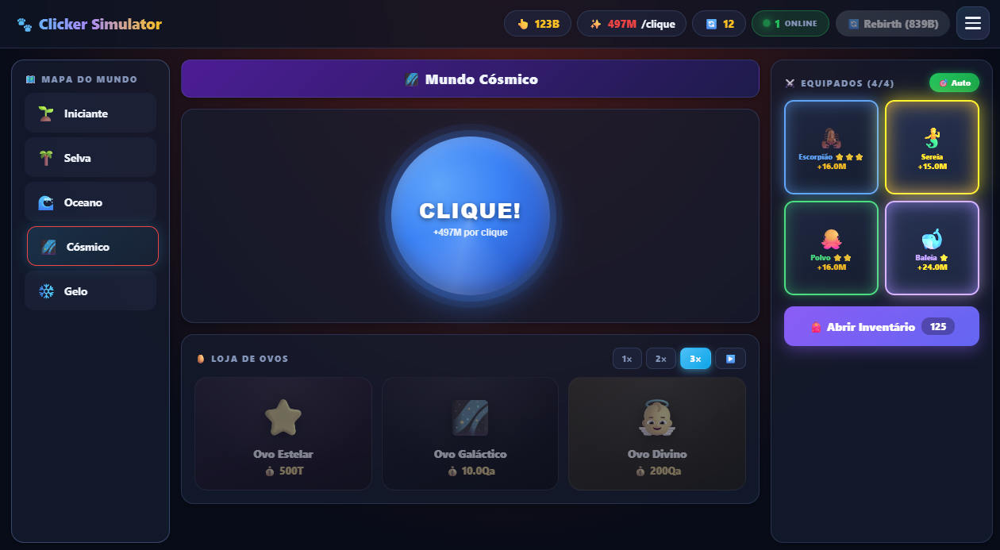 |
| Desbloqueado com **3 rebirths**. Criaturas marinhas. | Desbloqueado com **6 rebirths**. Seres divinos. |

| ❄️ Mundo Gelo | 🏆 Sistema Social |
|:---:|:---:|
| 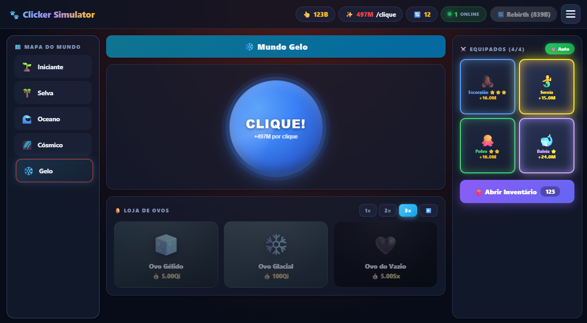 | 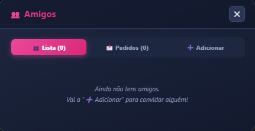 |
| Desbloqueado com **10 rebirths**. O reino do gelo eterno! | Adiciona amigos e vê quem está online. |

### ⭐ v1.4.0 — Ascensão & Progressão

| ⭐ Ascensão | 📈 Pet XP & Níveis |
|:---:|:---:|
| 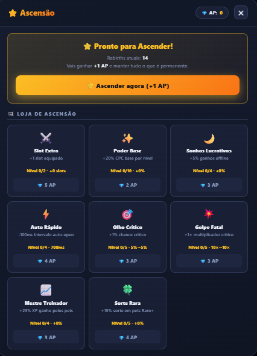 | 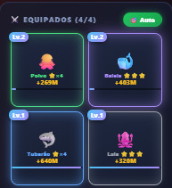 |
| Reset total após 10 rebirths. Ganha **Pontos de Ascensão** para gastar numa loja permanente. | Pets equipados ganham XP ao clicar. Cada nível dá **+5% multiplicador**. |

| 🎨 Skins do Botão | 🖱️ Tooltips Detalhados |
|:---:|:---:|
| 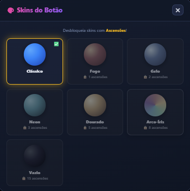 | 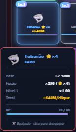 |
| 7 skins desbloqueáveis com Ascensões: Fogo, Gelo, Neon, Dourado, Arco-Íris e Vazio. | Passa o rato sobre um pet equipado para ver decomposição completa do multiplicador. |

### 🏪 v1.4.0 — Mercado & Definições

| 🏪 Mercado de Pets | ⚙️ Definições |
|:---:|:---:|
| 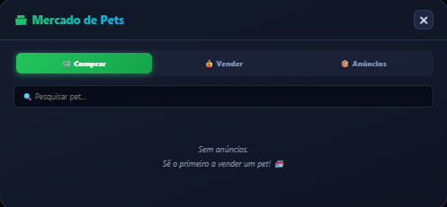 | 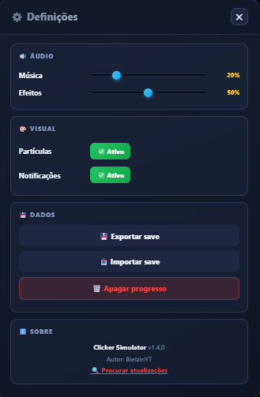 |
| Compra e vende pets com outros jogadores. Filtros e pesquisa incluídos. | Volume, partículas, notificações, export/import e reset de progresso. |

### 💬 Chat, Mensagens e Presentes

| 💬 Chat Global | 💌 Mensagens Privadas |
|:---:|:---:|
| 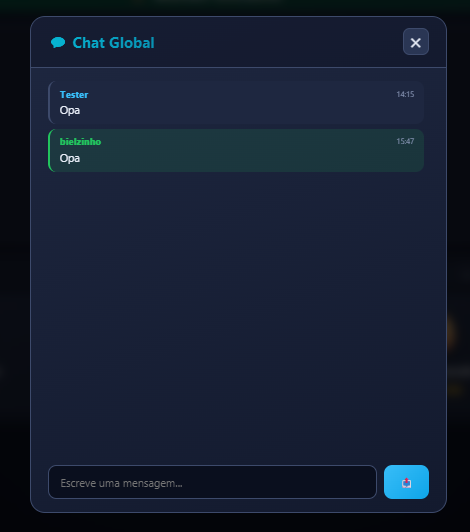 | 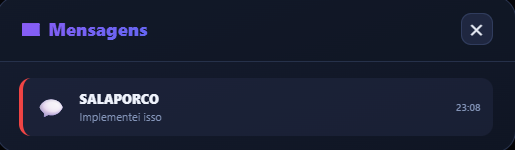 |
| Conversa em tempo real com todos os jogadores. | Conversas 1-a-1 com histórico. |

| 🎁 Presentes | 🎒 Inventário Renovado |
|:---:|:---:|
| 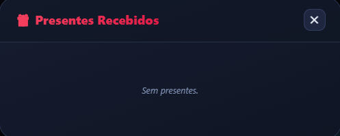 | 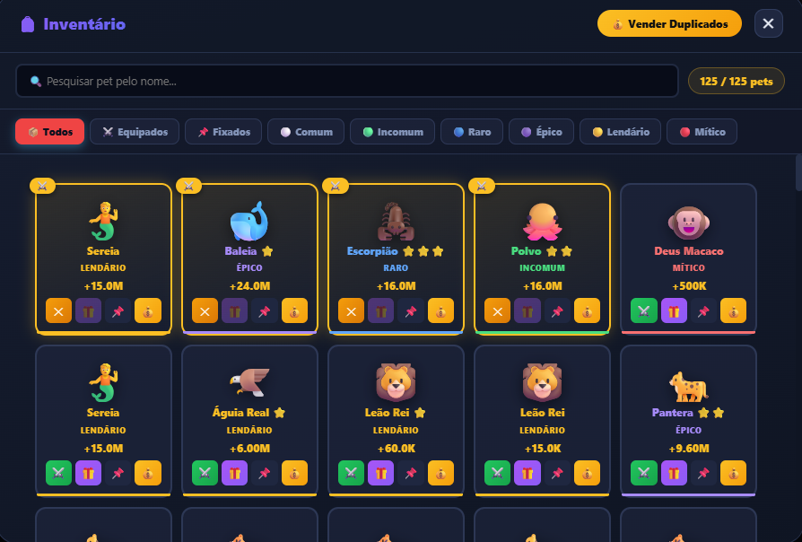 |
| Envia e recebe pets de outros jogadores. | Grid com filtros, pesquisa, tooltips e ações rápidas. |

### 🏆 Coleção de Pets

| 🌱 Iniciante | 🌴 Selva |
|:---:|:---:|
| 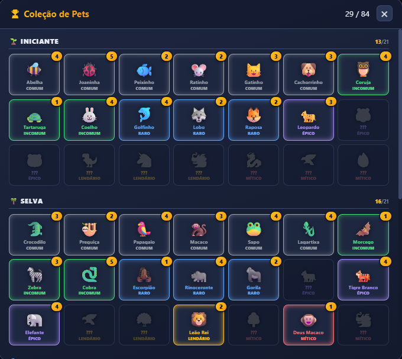 | 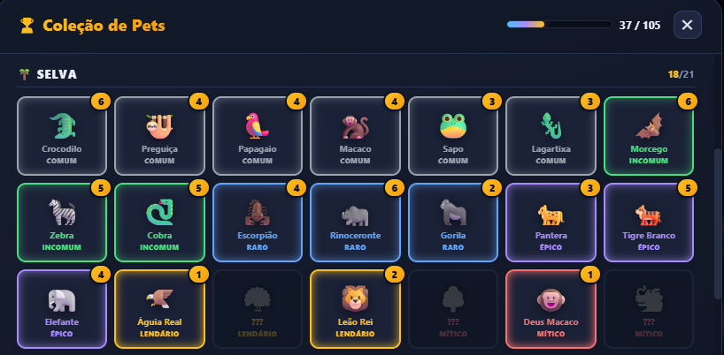 |

| 🌊 Oceano | 🌌 Cósmico |
|:---:|:---:|
| 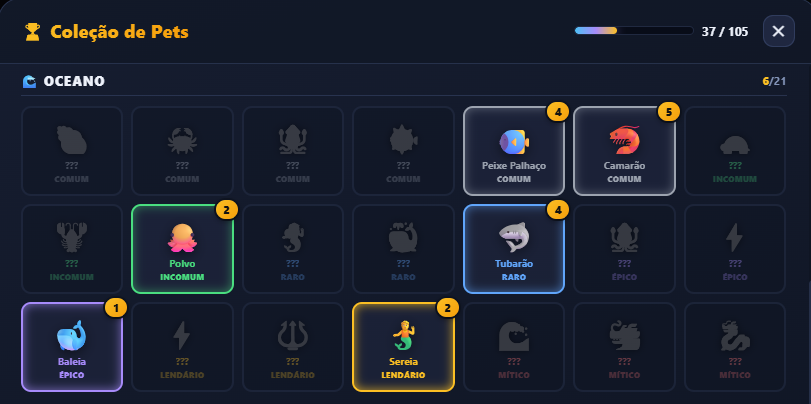 | 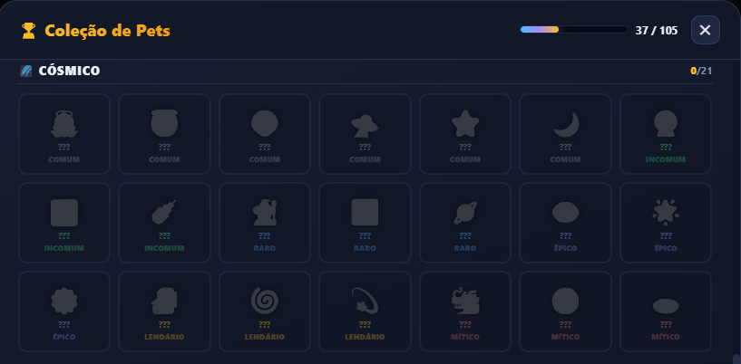 |

| ❄️ Gelo | 🧬 Fusões |
|:---:|:---:|
| 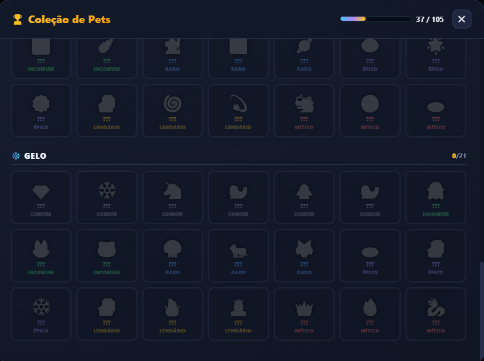 | 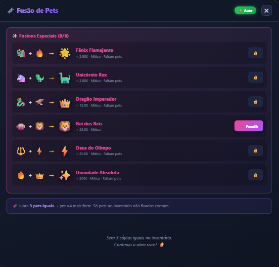 |
| 21 pets do reino gelado para descobrir! | Junta 3 iguais → pet ×4 mais forte. **6 Fusions Especiais** únicas! |

### 🏅 Rankings e Estatísticas

| 🌍 Ranking Total | 📅 Ranking Semanal |
|:---:|:---:|
| 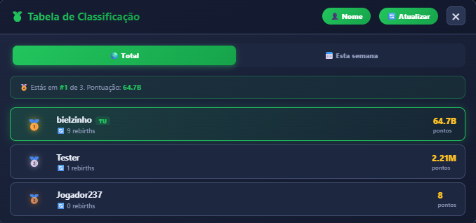 | 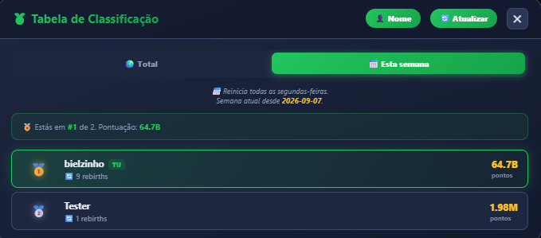 |
| Top 50 jogadores de sempre. | Reinicia todas as segundas-feiras. |

| 📊 Estatísticas | 🌈 Temas |
|:---:|:---:|
| 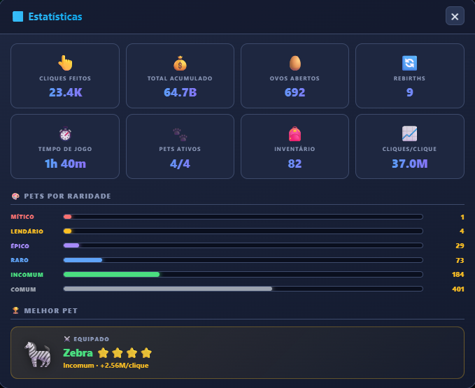 | 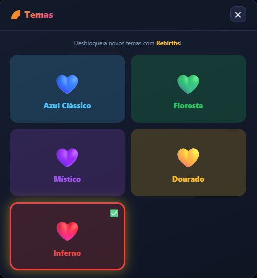 |
| Acompanha o teu progresso completo. | 5 temas desbloqueáveis com Rebirths. |

---

## ✨ Funcionalidades

### 🎮 Jogabilidade
- 👆 **Sistema de cliques** com multiplicador exponencial
- 💥 **Critical Hits** — 5% de chance de ganhar **×10** num clique (melhorável via Ascensão)
- 🥚 **15 ovos** distribuídos por **5 mundos** (cada um com skin e cor únicos!)
- 🐾 **180+ pets únicos** em **6 raridades** (Comum → Mítico)
- 🔄 **Sistema de Rebirth** — cada rebirth dá **+0.5× permanente**
- ⭐ **Ascensão** (2º prestígio) — reset total após 10 rebirths, ganha **Pontos de Ascensão** para gastar numa loja permanente com **8 upgrades únicos**
- 📈 **Pet XP & Níveis** — pets equipados ganham XP ao clicar, cada nível dá **+5% multiplicador** (máx Lv.100)
- 🧬 **Fusão normal** — 3 iguais viram 1 pet ×4 mais forte (com ⭐ infinitas)
- 🧬 **Fusions Especiais** — **6 combos únicos** de pets lendários (ex: Dragão Bebê + Fênix = Fênix Flamejante)
- ⚔️ **4 slots** de pets equipados (**+2 slots** com Ascensão)
- 💰 **Venda individual** e **venda em massa** de duplicados
- 📌 **Fixar pets favoritos** — não aparecem em vendas automáticas
- 🎉 **Milestones** — popup especial ao chegar a 1K, 10K, 100K, 1M, 1B...
- 🖱️ **Tooltips detalhados** — hover nos pets equipados mostra decomposição exata (base × fusão × nível)

### 🌐 Sistema Social (online)
- 💬 **Chat global** em tempo real
- 👥 **Sistema de amigos** — adiciona, aceita, vê quem está online
- 💌 **Mensagens privadas** entre amigos
- 🎁 **Enviar e receber pets** entre jogadores
- 💰 **Enviar cliques** aos teus amigos
- 🏪 **Mercado de Pets** — compra e vende pets com outros jogadores (filtros, pesquisa e histórico de anúncios)
- 🏅 **Ranking global** (top 50 de sempre)
- 📅 **Ranking semanal** (reinicia às segundas-feiras)
- 🟢 **Contador de jogadores online** em tempo real
- 🔔 **Notificações nativas do Windows** para eventos e mensagens

### 🤖 Automação
- 🎯 **Auto Equip Best** — equipa sempre os melhores pets
- ⚡ **Auto Fusão** — funde automaticamente todos os trios
- 🔢 **Multiplicador de ovos** — abre **1×, 2× ou 3×** de uma vez
- ▶️ **Auto Open** — abre ovos sozinho até acabar os cliques (velocidade melhorável via Ascensão)

### 🎨 Personalização
- 🌈 **5 Temas desbloqueáveis** — Azul, Floresta, Místico, Dourado, Inferno
- 🎨 **7 Skins do botão de clique** — Clássico, Fogo, Gelo, Neon, Dourado, Arco-Íris e Vazio (desbloqueadas com Ascensões)
- ✨ **Auras nos pets equipados** — brilho pulsante que escala com a raridade
- 🍔 **Menu hamburger** — todos os modos num menu compacto
- 🎒 **Inventário em modal** — grid limpo com filtros, pesquisa e tooltips
- 📊 **Estatísticas detalhadas** — cliques, ovos, críticos, ascensões e tempo de jogo
- 🏅 **Badges no chat** — Admin, VIP, Veterano, Avançado, Novato

### ⚙️ Sistema & Utilidades
- 💾 **Export/Import Save** — backup completo em JSON para transferires o progresso
- ⚙️ **Definições completas** — controlos de volume, partículas e notificações
- 🗑️ **Reset de progresso** — proteção com confirmação dupla
- 🔒 **Content-Security-Policy** — proteção contra XSS
- 📝 **Sistema de logs** — guarda em `%APPDATA%\Clicker Simulator\logs\main.log`

### 🎁 Eventos Globais
- 🌟 **Sistema de eventos** controlado pelo admin em tempo real
- ⚡ **Tipos de evento**: +Sorte, +Cliques, Desconto em Ovos, Desconto em Rebirth
- 📢 **Anúncios globais** para todos os jogadores
- 🎊 **Banner animado** no topo do jogo quando um evento está ativo

### 🎵 Experiência
- 👶 **Tutorial interativo** de 6 passos para novos jogadores
- 🌙 **Ganhos offline** — 10% do CPC/segundo enquanto estiveres fora (máx 8h, **melhorável via Ascensão**)
- 🎵 **Música de fundo** calma e efeitos sonoros (volume ajustável)
- 🎊 **Animações** ao abrir ovos e fogos de artifício em drops raros
- 💾 **Save automático** — progresso preservado entre sessões e atualizações
- 🔄 **Auto-atualização integrada** via GitHub Releases
- 🔍 **Verificação de atualizações** manual nas Definições

---

## 🆕 Histórico de Versões

### v1.4.0 — Ascensão, Mercado & Pet XP
- ⭐ **Ascensão** (2º prestígio) — reset total, ganha Pontos de Ascensão para gastar numa loja permanente com 8 upgrades
- 📈 **Pet XP & Níveis** — pets equipados ganham XP ao clicar (+5% mult/nível, máx Lv.100)
- 🎨 **Skins do Botão** — 7 skins desbloqueáveis com Ascensões
- 🧬 **Fusions Especiais** — 6 combos únicos de pets lendários
- 🏪 **Mercado de Pets** — compra e vende pets com outros jogadores
- ⚙️ **Definições** — volume, partículas, notificações, export/import e reset
- 🖱️ **Tooltips detalhados** nos pets equipados
- 💾 **Export/Import Save**
- 🔒 **Content-Security-Policy** para segurança
- 📝 **Sistema de logs** e auto-update mais robusto
- 🐛 **Corrigido** erro `Cannot find module 'electron-log'` que impedia o jogo de abrir após update

### v1.3.0 — Design Renovado & Menu Hamburger
- 🍔 Menu hamburger com todos os modos
- ✨ Design moderno com glassmorphism
- 🐛 Correção do bug das milestones (agora aparecem só uma vez)

### v1.2.1 — Correção de Estrutura
- 📁 Reorganização em `src/` e `assets/`

### v1.2.0 — Era Social & Mundo de Gelo
- ❄️ 5º mundo: Gelo (21 novos pets)
- 👥 Amigos, mensagens privadas e presentes
- 🌈 5 temas desbloqueáveis
- 🎒 Inventário em modal

### v1.1.0 — Áudio & Retenção
- 🎵 Música de fundo + efeitos sonoros
- 👶 Tutorial interativo
- 🌙 Ganhos offline

### v1.0.0 — Lançamento Inicial
- 🎮 4 mundos, 150+ pets, ranking online, chat

---

## 📥 Como Jogar

### Opção 1 — Descarregar o `.exe` (recomendado)

1. Vai à página de [**Releases**](https://github.com/BielzinYT/clicker-simulator/releases/latest)
2. Descarrega o `Clicker-Simulator-Setup-X.X.X.exe`
3. Corre o instalador
4. Se o Windows SmartScreen avisar → **"Mais informações"** → **"Executar mesmo assim"**
5. Abre o jogo e diverte-te! 🎉

> **Requisitos:** Windows 10 ou superior (64-bit) · ~250 MB de espaço livre

### Opção 2 — Correr a partir do código-fonte

```bash
git clone https://github.com/BielzinYT/clicker-simulator.git
cd clicker-simulator
npm install
npm start